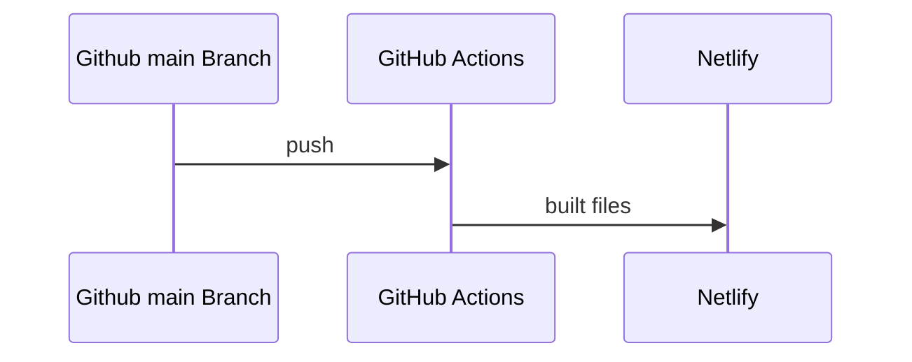

# Portfolio

Just a simple portfolio for different projects that have been worked on.

[See the live site here](https://tonyneuhold.com/)

## Architecture

There are two versions of this portfolio with some shared code between them. This was mainly done as practice managing a shared codebase with two largely different technologies and as a way to practice deployment for two different projects out of a monorepo.

- [React portfolio](./react)
- [Svelte portfolio](./svelte)

## Deployment Process

## Dev Setup

To start development for react:

- Run `yarn react` in the root directory

To start development for svelt:

- Run `yarn svelte` in the root directory

Note that changes to the shared folders such as `./config` and `./lib` need to have the dev startup command ran again to copy those files down into the react directory.
